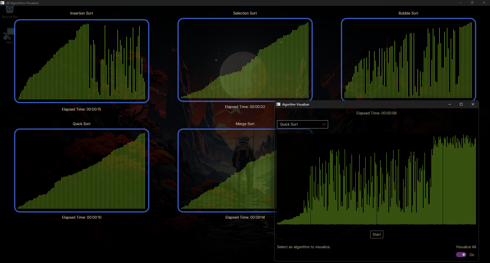

# Algorithm Visualizer



This project visualizes different sorting algorithms using a graphical interface. It is developed using .NET 8 and Avalonia UI framework.

## Technologies Used

- **Platform:** .NET 8
- **UI Framework:** Avalonia
- **Programming Language:** C#
- **IDE:** Visual Studio 2022 or JetBrains Rider

## Installation

1. **Download .NET 8 SDK:**
   - Download and install [.NET 8 SDK](https://dotnet.microsoft.com/download/dotnet/8.0) on your machine.

2. **Clone the Repository:**
   - Open a terminal in the directory where you want to clone the project and run:
     ```bash
     git clone https://github.com/mdincer34/AlgorithmVisualizer.git
     ```

3. **Run the Project:**
   - Navigate to the project directory and run the following command to build and run the project:
     ```bash
     dotnet run
     ```
   - The application will start using Avalonia's GUI.

## Usage

- Upon launching the application, you will see a list of different sorting algorithms you can visualize.
- Select an algorithm and click the `Start` button to see how the algorithm works visually.
- Use the `Pause` button to pause the visualization and `Resume` to continue.
- Use the `Reset` button to clear the visualizations and choose a different algorithm.

## Video Demonstration

[](https://www.youtube.com/watch?v=j2KCeqPmD_g)

Click the image above to watch a demo of the Algorithm Visualizer in action.

## Algorithms Supported

The application supports the following sorting algorithms:

- Bubble Sort
- Quick Sort
- Insertion Sort
- Selection Sort
- Merge Sort

## Contributing

1. Fork the repository.
2. Add new features or fix bugs.
3. Commit your changes.
4. Create a pull request.

## License

This project is licensed under the MIT License. For more details, see the [LICENSE](LICENSE.txt) file.

